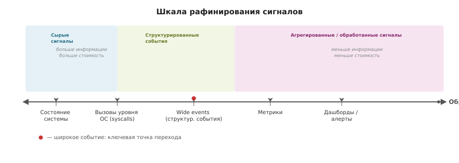
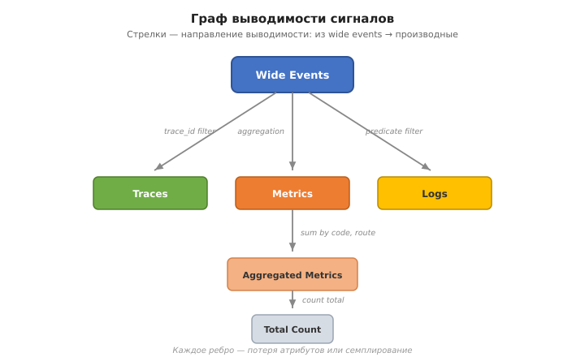

# Observability-сигналы: от трёх столпов к единой модели данных

## 1. Введение: о чём этот текст

Наблюдение за программными системами стало значимой инженерной проблемой с ростом микросервисов и распределённых архитектур. Традиционно выделяют **метрики, логи и трейсы** — так называемые «три столпа observability». Этот текст ставит под сомнение саму необходимость такого разделения: я покажу, что метрики, логи и трейсы — не фундаментальные категории, а исторически сложившиеся *производные формы* от более фундаментальной единицы — структурированного события (wide event). Переход от write-time к read-time обработке данных меняет представление о том, как следует собирать, хранить и анализировать телеметрию.

Текст носит исследовательский характер — это попытка построить связную картину, а не догма.

---

## 2. Что такое метрики, логи, трейсы — определения

Прежде чем обсуждать, достаточно ли их трёх, нужно зафиксировать, что каждое слово означает.

### Метрики

Метрики — это числовые данные, агрегируемые за конечный промежуток времени. Типичные виды: **counter** (счётчик, может только расти или сбрасываться: количество запросов), **gauge** (текущее значение: размер очереди, температура), **histogram** (распределение значений по бакетам: p99 latency). Ключевое свойство метрик — **агрегируемость их на записи**: пришедшее значение немедленно включается в скользящее окно, а исходное событие выбрасывается. Это делает метрики дёшевыми в хранении (фиксированный размер на временной ряд), но дорогими на чтении с точки зрения возможностей: **кардинальность** — количество уникальных значений ключа. Если у метрики есть лейблы `{endpoint, status_code, build_id}`, то число временных рядов растёт как произведение количества уникальных значений каждого лейбла. При `build_id` с 100 значениями и 50 endpoints × 5 status codes — уже 25 000 рядов. На практике многомерные лейблы с высокой кардинальностью убивают производительность метрических бэкендов (Prometheus, M3, TimescaleDB). Поэтому метрики *принудительно ограничивают* кардинальность — обычно советуют не больше десятка лейблов с низкой кардинальностью.

### Логи

Логи — это дискретные записи о событиях в системе: каждая запись — одна строка (структурированная, полуструктурированная или неструктурированная), обычно с timestamp и уровнем (info, warn, error). Логи **не агрегируются** на записи — каждое событие хранится целиком. Цена — **стоимость хранения и стоимость чтения** (поиска). В большом микросервисе каждый бизнес-запрос может породить десятки лог-строк от разных сервисов, и без trace_id коррелировать их приходится вручную, через парсинг и grep по временным окнам.

### Трейсы (распределённая трассировка)

Трейсы — это структуры данных, моделирующие жизненный цикл единичного запроса, проходящего через несколько сервисов. Основная единица — **span** (интервал времени, представляющий единицу работы в одном сервисе). Spans собираются в tree-структуру через **trace_id**, который передаётся в заголовках вызовов между сервисами. Span содержит parent_span_id, длительность, атрибуты.

Проблема трейсов — **семплирование** (sampling). Поскольку поток запросов огромен, сохранять все трейсы дорого. **Head-based sampling** решает на входе: какой % трейсов сохраняем, а остальные выбрасываем. Это означает, что для редких, но важных событий (например, сбой конкретного типа) вероятность быть сохранёнными равна вероятности любого трейса — то есть низкая. **Tail-based sampling** (решение: сохранить все трейсы, потом выборочно оставить важные) снимает эту проблему, но требует буферизации большого объёма данных и сложнее в реализации. **Репрезентативность** трейсов — насколько сохранённое подмножество отражает реальное распределение событий. При равномерном head-based sampling теряются редкие случаи (long-tail). При отборе только медленных трейсов теряется понимание доли медленных запросов в общем потоке.

### Сводные характеристики

| Сигнал | Запись | Чтение | Кардинальность | Типичные проблемы |
|--------|--------|--------|---------------|-------------------|
| Метрики | Агрегация | Ограниченная l | Низкая | Нельзя сгруппировать по атрибуту, не размеченному на записи |
| Логи | Неагрегированы | Дорогой поиск | Высокая (если структура сохранена) | Стоимость парсинга, разрозненность |
| Трейсы | Структурированы, семплированы | Tree view | Средняя (атрибуты span) | head sampling выбрасывает редкие события |

---

## 3. Observability-сигналы — это не аксиома, а результат оптимизации

Термин «три столпа» закрепился в индустрии после книги Cindy Sridharan и статей Peter Bourgon (2017–2018). Но это **инженерная эвристика**, а не фундаментальное свойство систем.

**Peter Bourgon, "Observability Signals" (2018):**
> "Metrics, tracing, and logging are actually emergent patterns of consumption of observability data, which inform the way we produce, ship, and store the corresponding signals. They're the product of an optimization function."

Ключевая мысль: деление на три категории — результат оптимизации под **стоимостные ограничения** (стоимость хранения, скорость записи, скорость чтения, допустимая кардинальность). Если бы существовала система с нулевой стоимостью записи/чтения и бесконечным хранением, разделения бы не было: все телеметрические данные хранились бы в единой сырой форме, а нужные представления формировались бы на чтении.

**Write-time vs read-time** — центральная ось компромисса:
- **Write-time обработка** (метрики, head-sampled трейсы): фиксируем на записи, как данные будут агрегироваться. Экономия на хранении. Плата — невозможность задать не запланированные на записи вопросы.
- **Read-time обработка** (logs, wide events): храним в сыром виде, интерпретируем на чтении. Максимум гибкости. Плата — стоимость хранения и latency запросов.

Граница между write-time и read-time определяют три величины:
1. **Стоимость дискового хранения** (GB/месяц)
2. **Скорость записи** (events/sec, cardinality tolerance)
3. **Скорость чтения** (latency для ad-hoc запросов, throughput)

**Вывод первого раздела:** три столпа — это исторический снимок компромисса, а не теорема.

---

## 4. Что изменилось: колоночные хранилища и object storage

Два технологических изменения сдвинули cost function:

**Колоночное хранение (columnar storage):** В отличие от строчных баз (PostgreSQL) или time-series движков, колоночные форматы (ClickHouse, Apache Parquet, GreptimeDB) читают только те колонки, которые нужны в запросе, и сжимают каждую колонку отдельно. Для широких событий с сотнями атрибутов, многие из которых пусты в конкретной записи, это даёт сжатие 5–20x по сравнению с row-oriented форматами. Запрос вида `SELECT COUNT(*) WHERE status != 200 GROUP BY build_id` читает только колонки `status` и `build_id`, игнорируя остальные 200 колонок с контекстом.

**Object storage (S3, MinIO, GCS):** Стоимость хранения упала на порядок. Терабайт в S3 стоит ~$6/месяц (было ~$150 в EBS десять лет назад). Это сделало affordable хранение месяцев сырых событий без агрегации — сценарий, который раньше был доступен только Facebook (Scuba) с кастомной инфраструктурой.

**Итог:** широкие события (wide events), сохраняющие все атрибуты бизнес-транзакции (user_id, build_id, feature_flags, payment_provider, ...) без write-time агрегации, стало possible and affordable. Это не новая идея — Scuba (Facebook, 2013) делала то же самое на кастомных свитчах. Новое — это commodity columnar storage на object storage.

---

## 5. Шкала «сырости» сигналов

Чтобы связать все типы сигналов в единую картину, предлагается ось «степени рафинирования» (raw → processed). Чем «сырее» сигнал, тем больше информации он содержит и тем более широкий круг вопросов может быть на него отвечен.

Ось организована от наиболее сырого (слева) к наиболее обработанному (справа):

**Слева: системное состояние**
- Самое «сырое». Регистры процессора, содержимое памяти, структуры данных ядра ОС, блочная карта диска. Физический снапшот всего. Содержит *всю* информацию о системе в момент времени. Практически: `/proc/kcore`, `coredump`, `crash dump`.

**Далее: вызовы уровня ОС**
- Последовательность системных вызовов (syscalls), которые делает программа. strace, dtrace, eBPF. Содержит все взаимодействия с ОС: чтение/запись файлов, сетевые пакеты, выделение памяти, переключение контекста. Из этого можно вывести *любое* поведение программы.

**Далее: события прикладного уровня (wide events)**
- Структурированная запись на единицу работы: «запрос /api/checkout, занял 1.8s, user_id=u8821, build=1.0.3, error=timeout». Сохраняет **все релевантные атрибуты** бизнес-контекста. Не агрегирует, не семплирует (или семплирует осознанно с tail-based стратегией). Это «самая правая» позиция, где сохранена кардинальность и семантика.

**Далее: агрегированные сигналы**
- **Метрики:** счётчики, гистограммы, которые слили множество событий. Кардинальность потеряна.
- **Трейсы (head-sampled):** значительная доля событий выброшена.
- **Логи (без trace_id):** контекст потерян, корреляция затруднена.

**Справа: дашборды и алерты**
- Предварительно подсчитанные агрегаты по fixed метрикам, с thresholds и visualisations. Ответы на заранее заданные вопросы.

### Связь со шкалой

| Свойство | Левая часть | Правая часть |
|----------|-------------|--------------|
| Информация | Максимум | Минимум |
| Стоимость хранения | Высокая | Низкая |
| Стоимость обработки на чтении | Ниже (не нужно распаковывать) | Выше (уже сжаты, но ответ ограничен) |
| Спектр ответимых вопросов | Любые | Только запланированные |
| Write-time обработка | Минимальная | Максимальная |

### Sushi Principle

Сформулирован Bobby Johnson и Joseph Adler (Strata+Hadoop World 2015), процитирован Martin Kleppmann в «Designing Data-Intensive Applications»:

> Raw data is better. Сырые данные можно приготовить разными способами. Приготовленные данные (агрегированные, обработанные) нельзя вернуть к сырому виду без потери.

Применительно к observability: **из wide events можно вывести метрики, трейсы и логи. Из метрик wide events не восстановить.** Статистика Sushi Principle — аргумент в пользу того, чтобы хранить данные настолько «лево», насколько позволяет бюджет. Хранить wide events выгоднее, чем три отдельных копии (метрики + трейсы + логи) с взаимными потерями.

### Monitoring и Observability на шкале

Гипотеза, которую я защищаю:

- **Monitoring** — ответы на *known unknowns* (заранее известные вопросы). Располагается в правой части шкалы: дашборды, алерты, агрегированные метрики. Это про «CPU > 90%», «error rate > 1%», «daily active users». Monitoring не может ответить на вопрос, который не был запланирован при конфигурации метрик.

- **Observability** — ответы на *unknown unknowns* (незапланированные вопросы). Располагается в левой части шкалы: observability возможна ровно настолько, насколько «сырые» данные доступны. Wide events — минимально достаточная форма для осмысленного наблюдения, потому что они сохраняют контекст для *произвольных* сечений.

### Root Cause Analysis и шкала

Глубина RCA (Root Cause Analysis) прямо соотносится с позицией на шкале. Чем левее мы способны заглянуть, тем глубже можем копать.

**Пример 1 (диск):**
- Сигнал «занятое место на диске 95%» (метрика) → answer: «диск почти полон». Это RCA уровня метрики.
- Сигнал «размер /var/log/app.log = 47GB» (wide event размера каждого файла) → answer: «лог-файл вырос».
- Сигнал «размеры файлов в /var/log/» (список файлов и их размеров) → можно сказать, какие конкретно файлы заняли место.
- Сигнал «write() /var/log/app.log вызывается 10k раз/сек» (syscall) → можно найти причину роста.

Каждый шаг влево добавляет детализацию, но требует более сырого сигнала. Цепочка: размеры файлов → размеры по директориям → размеры верхнеуровневых директорий → тотал диска.

**Пример 2 (CPU):**
- Алерт «CPU > 90%» (булев агрегат).
- Метрика `cpu_usage_percent{}` — сколько всего используется CPU.
- Метрика `cpu_usage_percent{process}` — какой процесс потребляет CPU.
- Метрика `cpu_usage_percent{process, thread}` — какой тред внутри процесса.
- Wide event с стектрейсом — какая функция выполняется.
- Syscall-level — какие системные вызовы делает процесс.

Закономерность: чем конкретнее вопрос (CPU > 90% → какой процесс? → какой тред? → какая функция? → какой syscall?), тем левее на шкале нужен сигнал и тем дороже его получить. На каждом шаге агрегации данные сжимаются, а спектр ответимых вопросов сужается.

**Предел:** observability может найти root cause, который находится на её уровне или *правее*. Если вся доступная телеметрия — метрики (`cpu_percent`), то вопрос «какая функция потребляет CPU» неотвечаем — метрика не хранит call stacks. Если есть wide events с атрибутом `stack_trace` — ответ становится возможным.

Из этого следует, что проектирование observability-системы — это выбор: **до какого уровня глубина RCA должна быть доступна**, и какая цена за это приемлема.

---

## 6. Граф выводимости сигналов

Шкала сырости — это общая картина. Граф выводимости уточняет частный, но важный случай: связь между wide events и их *производными*.

- **Wide events** — корень. Единый источник.
- **Traces** (трейсы): селекция по `trace_id` — выборка событий, относящихся к одной транзакции, упорядоченная по parent-child.
- **Metrics** (метрики): агрегация по временному окну — счётчики, гистограммы по выбранным атрибутам.
- **Logs** (логи): предикатная фильтрация (например, `error IS NOT NULL`) событий, часто с дополнительным бесструктурным полем.
- **Агрегированные метрики**: из `requests_count{code, route}` → `codes_count{code}` (суммирование по route) → `total_requests{}` (суммирование по code).

**Отношение выводимости асимметрично.** Если сигнал A можно вывести из сигнала B, то A содержит *меньше* информации, чем B. Из `codes_count{code}` нельзя восстановить `requests_count{code, route}`, потому что измерение `route` было потеряно при агрегации.

Wide events — начальная вершина графа (максимальный по информации сигнал в рамках этого подграфа). Спектр производных — агрегаты с последовательной потерей атрибутов.

Это **часть** общей картины, описанной шкалой сырости. Граф выводимости показывает отношение между *теми сигналами, которые принято называть наблюдательными*. Полная картина включает в себя и более сырые формы (системные вызовы, снапшоты памяти), которые не могут быть выведены из широких событий, но из которых широкие события могут быть выведены.

---

## 7. Profiling / Continuous Profiling

**Profiling** (профилирование) — метод измерения того, как программа использует аппаратные ресурсы во время выполнения. Инструмент берёт выборки (samples) текущего call stack'а с заданной частотой (типично 100–1000 Hz). Затем эти samples агрегируются в распределения: какой % CPU времени проведён в какой функции. Типичные метрики: CPU profile (какие функции загружают процессор), memory profile (какие функции аллоцируют память), mutex profile (какие блокировки ждут больше всего), goroutine/thread profile (сколько потоков активны, где они).

**Continuous Profiling** — профилирование, работающее *непрерывно* в production, а не включаемое вручную для отладки. Инструменты: Pyroscope (Grafana), Parca, Google Cloud Profiler. Разница с традиционным профилированием — в масштабировании: миллионы выборок в день для тысяч инстансов.

**Является ли continuous profiling «четвёртым столпом» observability?**

Аргумент «да»: профили — это измерение *внутреннего* состояния системы (распределение вычислительных ресурсов), которое не покрывается метриками, логами и трейсами. Можно иметь 100% покрытие трейсами, P99 latency=300ms, error rate=0%, и всё ещё не знать, что `json.Unmarshal` занимает 40% CPU. Continuous profiling даёт ответ на вопрос «почему приложение медленное, хотя ни один отдельный запрос не превышает лимит» — вопрос, неотвечаемый тремя столпами.

Аргумент «нет»: профили — это *частный случай сырых данных*, лежащий на левее wide events. Continuous profiling — просто агрегированный snapshot распределения call stack'ов. Из wide events, содержащих контекст каждого вызова функций (entry/exit event для каждой функции), профили *теоретически* можно восстановить. Практически это непомерно дорого: если wide event — это запись на каждый запрос, то profile event — это запись на каждый вызов функции, и таких событий миллиарды в минуту.

**Вывод:** continuous profiling — не четвёртый столп, и не обязательно отдельный горизонт. Всё зависит от granularity, на которой мы записываем wide events.

Если wide event фиксирует запрос целиком и не содержит информации о внутреннем распределении ресурсов (только `duration_ms` и `status_code`), то profiling — действительно более сырой сигнал, который нельзя вывести из такого wide event. Но можно рассуждать иначе: если стектрейс (call stack sample) рассматривать как атрибут широкого события — например, один wide event «запрос /api/checkout» может нести массив `[stack_frame_1, stack_frame_2, ...]`, то из таких событий профили *выводятся* как агрегация: сколько раз каждая функция встретилась в стектрейсах. Тогда profiling оказывается *производной* от wide events, а не отдельным видом сигнала.

Это важный теоретический момент: wide events могут быть сколь угодно «толстыми». Если мы сохраняем в каждом wide event достаточно контекста (включая внутрипроцессные сэмплы), profiling становится частью графа выводимости. Ограничение — *практическое*: profiler собирает 100–1000 samples/sec на процесс, wide events — сотни событий/сек. Даже если вписать стектрейс в каждый wide event, получится лишь малая выборка от того, что даёт полноценный profiler. Поэтому на практике profiling — отдельный инструмент с собственными tradeoffs, но *теоретически* это не фундаментальный разрыв.

Наиболее точная формулировка: **профили — это инструмент, закрывающий зону между уровнем wide events (бизнес-транзакция) и уровнем syscalls (вызовы ОС), с собственной экономикой сбора и хранения. Они могут быть как независимым сигналом, так и атрибутом wide events — в зависимости от того, насколько глубоко мы инструментируем систему.**

---

## 8. Что такое телеметрия

**Исходное значение, из физики:** автоматический сбор и передача измерений от удалённого объекта (ракета, спутник, буровая установка) на центральную станцию. Канал.

**В IT (определение IBM):**
> Telemetry is the automated collection and transmission of data and measurements from distributed or remote sources to a central system for monitoring, analysis and resource optimization.

**В контексте разработки ПО:** телеметрия — сбор любых сигналов от программных компонентов — как сырых (eBPF, syscalls, wide events), так и обработанных (агрегированные метрики, фильтрованные логи). Телеметрия — это **процесс доставки** данных от системы к человеку (или автоматике). Её не интересует форма данных, её интересует pipeline: instrumentation → transport → storage.

Сбор информации об использовании программы (какие функции вызывал, как долго работал) — это разновидность телеметрии, часто называемая **product telemetry** (user behaviour analytics, crash reporting, feature use counts). Она отличается от observability-телеметрии *целью*:
- Product telemetry → понимание поведения пользователя.
- Observability telemetry → понимание поведения системы.

**Разница между терминами:**

| Термин | Уровень | Суть |
|--------|---------|------|
| Телеметрия | Инженерный | Сбор и передача данных, безотносительно их анализа |
| Мониторинг | Операционный | Отслеживание известных состояний системы (пороги, алерты) |
| Observability | Аналитический | Исследование системы без заранее известного вопроса |

Мониторинг и observability *работают поверх* телеметрии. Телеметрия — обязательный, но не достаточный слой: без неё нет данных, с ней сами по себе данные не отвечают.

---

## 9. Что в «левом» краю — подробно

Если двигаться по шкале сырости влево от wide events, получаем иерархию уровней абстракции:

1. **Снапшот состояния системы** (машинный уровень)
   - Содержимое регистров процессора, страницы физической памяти, состояние периферии. Максимально возможный уровень детализации. Практически: `/proc/kcore`, полный дамп ядра.
   - Из него можно восстановить всё: значения всех переменных, состояние всех потоков, содержимое файлового кэша, таблицы маршрутизации.

2. **Трассировка системных вызовов**
   - Каждое взаимодействие программы с ОС: open(), read(), write(), sendmsg(), mmap(). Кроме значения вызова — аргументы (какой файл, сколько байт, какой буфер).
   - Инструменты: strace, eBPF, dtrace.
   - Менее сырой, чем полный снапшот, потому что не включает значения в *пользовательской* памяти до и после вызова. Но достаточно для восстановления семантики работы программы.

3. **Вызовы функций прикладного уровня**
   - Вход и выход из функций с аргументами и возвращаемыми значениями. Уже семантически богаче syscalls: вместо read(fd=3, len=4096) → «открыли файл конфига».
   - Инструменты: function tracers (Ftrace USDT probes, DTrace pid provider, runtime-specific probes).
   - Из этого можно восстановить последовательность бизнес-логики.

4. **Структурированные события (wide events)**
   - Запись на единицу работы, сохраняющая все атрибуты высокого уровня: какой запрос, откуда, с какими флагами, сколько длился, что вернул.
   - Это «самое правое» из того, что ещё не является метрикой/трейсом/логом в классическом понимании.

**Закономерность:** каждый переход вправо на шаг теряет информацию, но в выигрыше — на порядки меньший объём данных и, соответственно, стоимость. Снапшот системы — гигабайты на одну машину в секунду. Wide event — килобайты на запрос. Разница > 6 orders of magnitude.

---

## 10. Примечание о терминах

**Bourgon position paper** — статья Peter Bourgon «Observability Signals» (2018), в которой он изложил позицию (отсюда «position paper»), что все наблюдательные сигналы фундаментально едины и разделение на три категории — результат инженерной оптимизации. Статья является ключевой в этой дискуссии.

**OpenTelemetry** — open-source фреймворк для сбора и доставки телеметрии. См. отдельный файл `opentelemetry.md`.

---

## Вопросы для дальнейшей разработки

- [ ] Являются ли profiling / continuous profiling «чётвёртым столпом» или инструментом низкоуровневой диагностики (см. раздел 7)?
- [ ] Как в модель шкалы сырости ложится OpenTelemetry — он про телеметрию или уже про форму данных?
- [ ] Атаки на модель wide events: стоимость, качество instrumentation, сложность семплирования при очень высоких объёмах.
- [ ] Как шкала сырости соотносится с архитектурными паттернами (event sourcing, CQRS, командная шина)?
